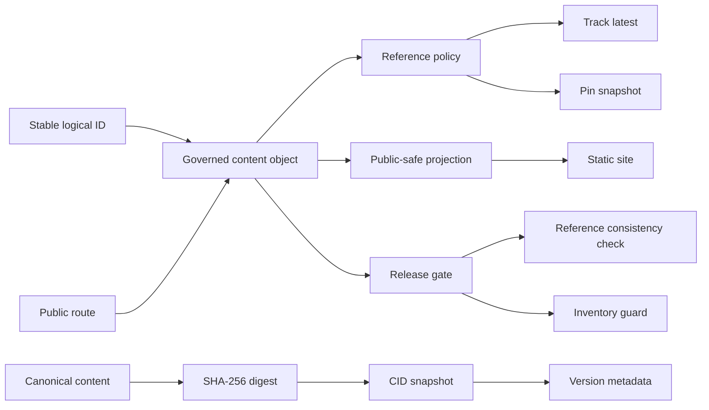
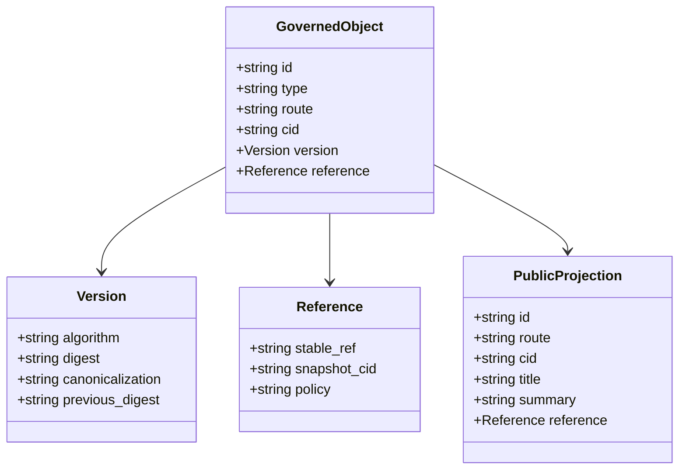
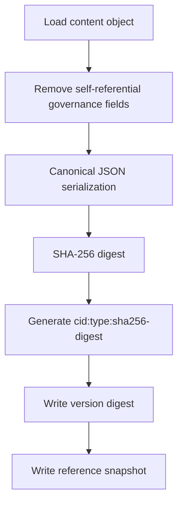
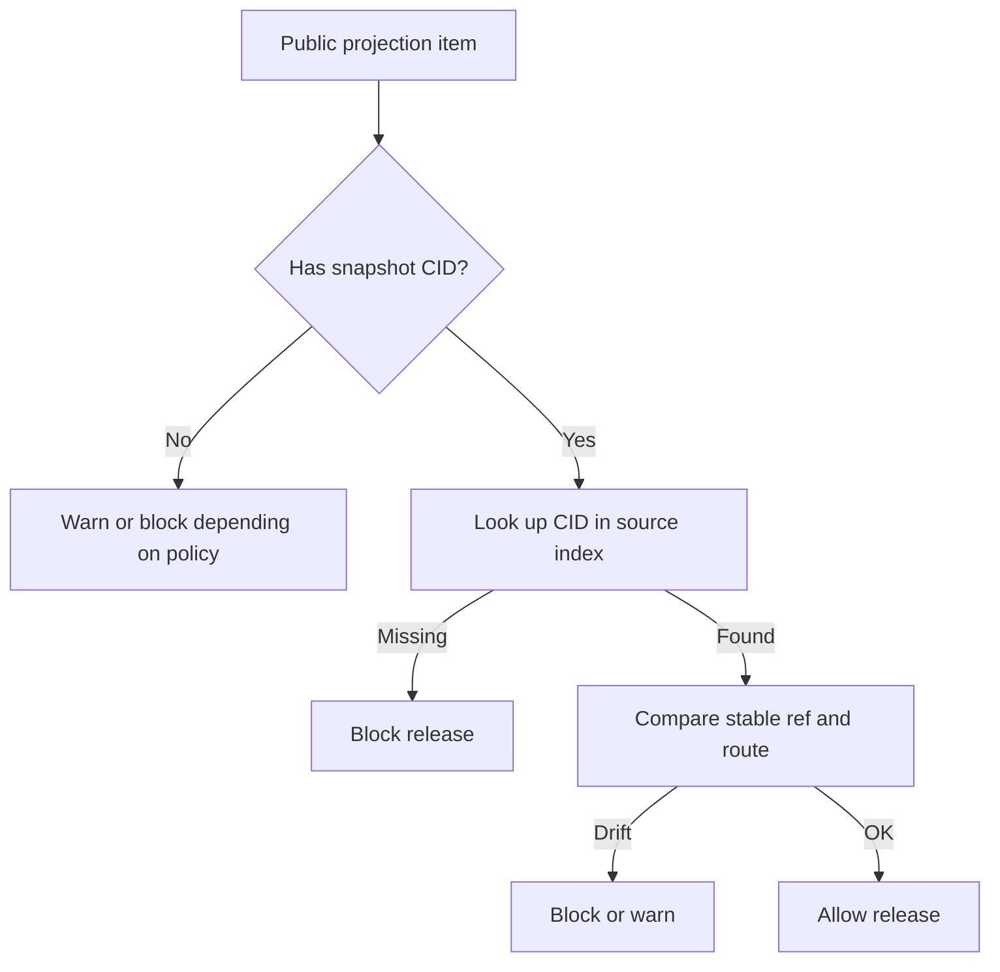
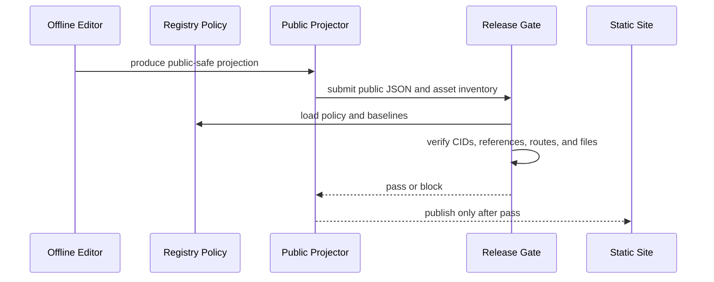

# Static CID Governance Diagrams

## Concept map

```mermaid
flowchart LR
  A[Stable logical ID] --> C[Governed content object]
  B[Public route] --> C
  D[Canonical content] --> E[SHA-256 digest]
  E --> F[CID snapshot]
  F --> G[Version metadata]
  C --> H[Reference policy]
  H --> I[Track latest]
  H --> J[Pin snapshot]
  C --> K[Public-safe projection]
  K --> L[Static site]
  C --> M[Release gate]
  M --> N[Reference consistency check]
  M --> O[Inventory guard]
```

## Class-level model

```mermaid
classDiagram
  class GovernedObject {
    +string id
    +string type
    +string route
    +string cid
    +Version version
    +Reference reference
  }
  class Version {
    +string algorithm
    +string digest
    +string canonicalization
    +string previous_digest
  }
  class Reference {
    +string stable_ref
    +string snapshot_cid
    +string policy
  }
  class PublicProjection {
    +string id
    +string route
    +string cid
    +string title
    +string summary
    +Reference reference
  }
  GovernedObject --> Version
  GovernedObject --> Reference
  GovernedObject --> PublicProjection
```

## CID generation flow

```mermaid
flowchart TD
  A[Load content object] --> B[Remove self-referential governance fields]
  B --> C[Canonical JSON serialization]
  C --> D[SHA-256 digest]
  D --> E[Generate cid:type:sha256-digest]
  E --> F[Write version digest]
  F --> G[Write reference snapshot]
```

## Reference alignment flow

```mermaid
flowchart TD
  A[Public projection item] --> B{Has snapshot CID?}
  B -- No --> C[Warn or block depending on policy]
  B -- Yes --> D[Look up CID in source index]
  D -- Missing --> E[Block release]
  D -- Found --> F[Compare stable ref and route]
  F -- Drift --> G[Block or warn]
  F -- OK --> H[Allow release]
```

## Release gate sequence

```mermaid
sequenceDiagram
  participant Editor as Offline Editor
  participant Registry as Registry Policy
  participant Projector as Public Projector
  participant Gate as Release Gate
  participant Site as Static Site
  Editor->>Projector: produce public-safe projection
  Projector->>Gate: submit public JSON and asset inventory
  Gate->>Registry: load policy and baselines
  Gate->>Gate: verify CIDs, references, routes, and files
  Gate-->>Projector: pass or block
  Projector-->>Site: publish only after pass
```
